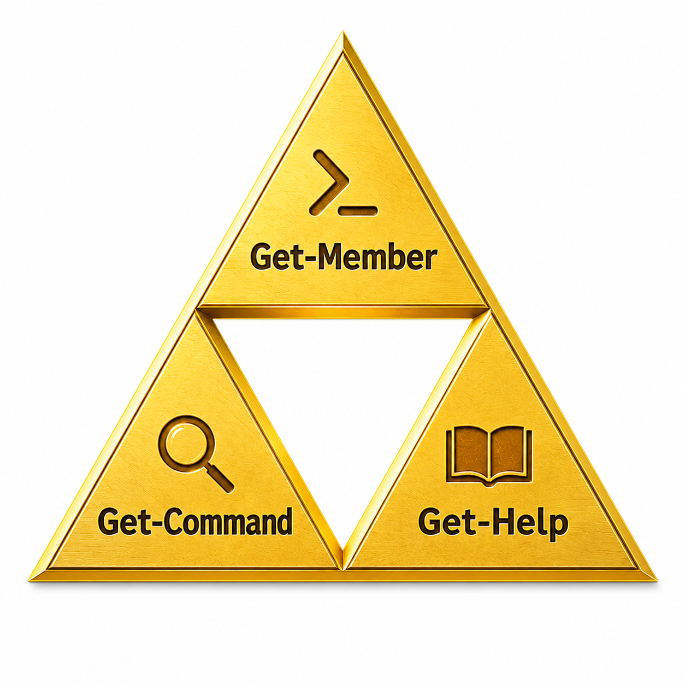

# Syntaxe des commandes PowerShell

Les commandes PowerShell suivent presque toujours la même structure :

```text
Verbe-Nom -Paramètre Valeur
```

Exemple :

```powershell
Get-Service -Name Spooler
```

- `Get` → action
- `Service` → cible
- `-Name` → paramètre
- `Spooler` → valeur du paramètre

---

## Les verbes standards PowerShell

PowerShell utilise des verbes standards pour rendre les commandes cohérentes et prévisibles.

| Verbe | Signification |
|---|---|
| `Get` | Lire / récupérer |
| `Set` | Modifier |
| `New` | Créer |
| `Remove` | Supprimer |
| `Start` | Démarrer |
| `Stop` | Arrêter |
| `Restart` | Redémarrer |
| `Test` | Vérifier |

Exemples :

```powershell
Get-Service
Stop-Service
Restart-Service
```

Afficher tous les verbes approuvés :

```powershell
Get-Verb
```

!!! tip "Pourquoi c'est important"
    Une fois cette logique comprise, il devient beaucoup plus facile :
    
    - de deviner ce qu'une commande fait,
    - de retrouver une commande,
    - d'apprendre PowerShell seul.

---

## La Triforce PowerShell

Trois commandes permettent de découvrir pratiquement tout PowerShell :



| Cmdlet | Rôle |
|---|---|
| `Get-Command` | Trouver des commandes |
| `Get-Help` | Comprendre comment les utiliser |
| `Get-Member` | Explorer les objets retournés |

---

## `Get-Command` — trouver des commandes

Afficher toutes les commandes disponibles :

```powershell
Get-Command
```

Rechercher les commandes liées aux services :

```powershell
Get-Command *Service*
```

Afficher uniquement les commandes utilisant le verbe `Get` :

```powershell
Get-Command -Verb Get
```

Rechercher les commandes d'un module :

```powershell
Get-Command -Module Microsoft.PowerShell.Management
```

---

## `Get-Help` — comprendre une commande

Afficher l'aide d'une commande :

```powershell
Get-Help Get-Service
```

Afficher les exemples :

```powershell
Get-Help Get-Service -Examples
```

Afficher l'aide complète :

```powershell
Get-Help Get-Service -Full
```

Ouvrir la documentation Microsoft :

```powershell
Get-Help Get-Service -Online
```

!!! tip "Mettre à jour l'aide locale"
    Télécharger les dernières documentations :

    ```powershell
    Update-Help
    ```

    Cette commande nécessite souvent des droits administrateur.

---

## `Get-Member` — explorer les objets

Afficher les propriétés et méthodes d'un objet :

```powershell
Get-Process | Get-Member
```

Exemple de résultat :

```text
TypeName: System.Diagnostics.Process

Name        MemberType Definition
----        ---------- ----------
Kill        Method     void Kill()
Id          Property   int Id {get;}
Name        Property   string Name {get;}
```

!!! info "Le réflexe PowerShell"
    Quand vous découvrez une nouvelle commande :

    1. Trouvez-la avec `Get-Command`
    2. Consultez son aide avec `Get-Help`
    3. Explorez son résultat avec `Get-Member`

Avec ces trois commandes, vous pouvez apprendre PowerShell de manière autonome.